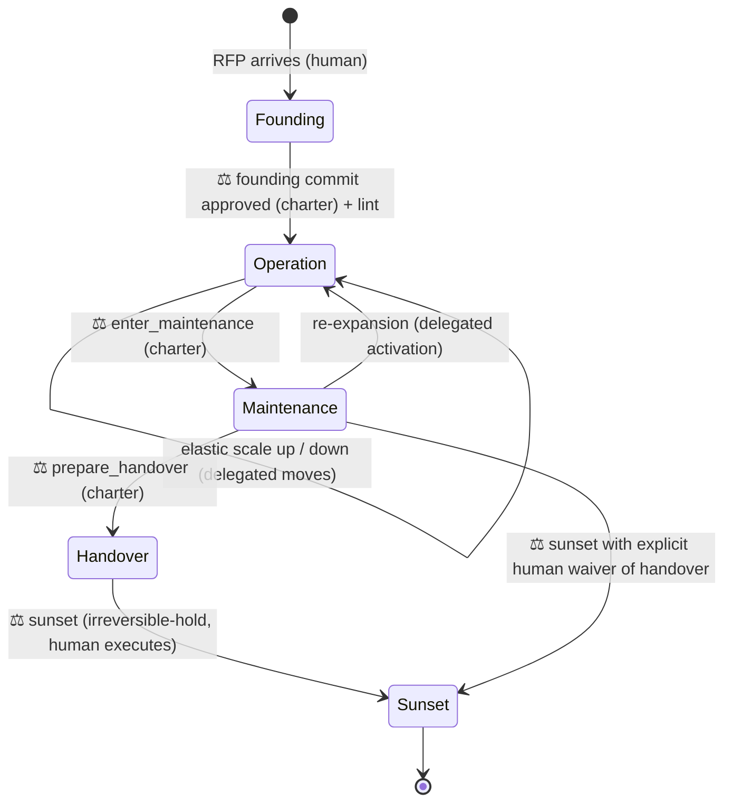

# 05 — Operating a Running Company: Lifecycle, Safety Events, and Still-Right-Problem Checks

*Part III · Operate — see [the four-part map](README.md).*

> This document is the single arc of a 24/7 running organization: how it is **founded from
> an RFP**, how it **runs around the clock** with the human deciding only the essential things,
> how it **scales and shrinks elastically** (docs/02), how it stays **safe and reliable** while
> the human sleeps, how it keeps checking it is **still solving the right problem**, and how it
> **ends** — maintenance, handover, sunset. Three things braid together and never come apart:
> the **org lifecycle** (founding → operation → maintenance → sunset), the **operating events**
> a running company must perform without meetings (safety caps, reconciliation, the reliability
> budget, the self-driving schedule), and the **still-right-problem checks** up the proxy stack
> (is the telos still valid? is a course worth continuing? whose mandate governs?).
>
> The design goal restates the whole thesis operationally: a human CEO decides the few essential
> things and delegates the thousand small ones, drawing that line *by feel*; here the line is
> **written down** so the AI can run the small decisions unattended while the human's 8 hours go
> to the essential ones. Everything below — the three tiers, the approval queue, the morning
> digest, the fail-quiet operating events, the proxy-stack sensors — is that articulated decision
> line in operation. Calibrate it to risk (docs/01 §5): the ceremony is for the stakes that warrant
> it, not for every trivial call — over-governing recreates the bottleneck delegation was meant to
> remove. orgforge stands up an AI-native IT **business company** that builds through a forced SDLC
> mold (docs/11), operates under the reliability budget + DORA kept here, and grows system and org
> together (THEORY.md §1b is the frame).

The lifecycle state machine (edges marked ⚖ require human adjudication — they are
charter- or irreversible-tier):



Every transition is a commit; every commit passes the audit lint (tools/org_lint.py).
The lint validates the resulting *state* (SoD, span, control-never-dormant, schema);
tier enforcement — that the right authority approved the transition — is the runtime's
job, recorded in the ledger.

---

## 1. Founding: from RFP to organization

The cradle. A human hands the system an RFP (or any statement of what must be built),
together with a **constitution instance authored by the humans beforehand** (the founder
works inside it and cannot write it). A **founder process** — see `template/FOUNDER.md`
— turns the RFP into a complete latent organization in four steps:

1. **Distill the telos (Organ 1).** The RFP is restated as a one-sentence purpose that
   every department will carry in its context pack (as the intent block, docs/07 §2.1).
   The RFP itself is preserved in the ledger as the purpose's source document; the
   *admission standard* is derived from its acceptance criteria — and every criterion
   must reference at least one gaming-defense instrument (nulls, placebos, forward
   tests), or the founding is returned to the humans.
2. **Derive the target architecture, then the org (inverse Conway).** Decide the shape
   of the *system* the RFP describes first; then shape the departments and their
   communication paths to mirror it (docs/04 §3). The org chart is a consequence of the
   product architecture, never the other way around.
3. **Decompose the RFP into output contracts.** Each department gets a *mission* stated
   as a deliverable slice of the RFP — **what** it owes and to what standard, never
   **how** (standardization of outputs, Mintzberg). This is what lets departments work
   **independently toward the shared RFP**: coordination happens through the contract
   seams (docs/07 §2.3), the shared ledger, and context packs — not through a central
   agent dictating steps. Each contract names its Checker; no contract is admitted by
   its own Maker.
4. **Design fully, activate minimally (docs/02).** The chart includes every department
   the RFP will *ever* need — including the maintenance watch and the handover packager
   — all latent. Then activate the smallest set the first milestone requires, plus the
   control skeleton (gate, skeptic, supervisor, registrar), which is active whenever
   anything is.

Founding's four steps produce **four fixed-name artifacts** — `REQUIREMENTS.md`, `FEATURE-INVENTORY.md`,
`ARCHITECTURE.md` (the whole-system design from step 2), and `coverage-manifest.md` (step 3's
RFP→contract map) — plus `organization.yaml`. The names are fixed by rule (docs/11 §0a) because the
step *after* founding reads them by name.

5. **Decompose the contracts into atomic task Issues.** Steps 1–4 decide *who owes what*; this turns
   each owed deliverable into units a department can actually pick up: one independently-completable
   task per unit, split wherever sibling `owns` territories are disjoint, each carrying its own full
   spec so a maker with none of the founding context can start (docs/11 §4b). Founding is not finished
   when the chart lints — it is finished when every must-have has become work. A must-have that has an
   owning contract but no task is *designed and unbuilt*, which reads as coverage on the org chart and
   as silence in the backlog; a mechanical coverage gate (docs/11 §0a) is what makes that state
   impossible to hold. This step runs only **after** the human approval below — decomposing an
   unapproved draft mints work the humans may cut.

**The founding commit is charter-tier: it requires human approval, not just the lint.**
The founding commit defines the SoD matrix, the contracts, and the admission standard —
the most control-critical act in the org's life — and a mechanical shape-check cannot
judge whether an acceptance criterion is a gameable proxy. The humans sign the chart the
org will be held to; Stinchcombe's imprinting result says founding conditions persist,
so this is the cheapest moment to get control right. Founding ends when the commit has
both lint pass and human approval, and the first activation set is running. Everything
after this line is autonomous, within the constitution.

### 1.1 Independent execution, shared consciousness

After founding, no agent tells a department *how* to meet its contract. Autonomy is made
safe the McChrystal way (docs/04 §6), refined by the context economy (docs/07): every
department cycle begins with a context pack holding the intent block, its own contract
and doctrine (docs/06), the live state of its adjacent contracts, and nearby failures —
and nothing else by default. Departments coordinate through contract interfaces and the
ledger — mutual adjustment at the seams, never central micromanagement in the middle.

---

## 2. Around-the-clock operation: humans above the loop, not in it

An agent org's structural advantage is a 24-hour duty cycle against the humans' 8. The
design error to avoid is making human approval a **synchronous blocker** — that re-caps
the org at human hours. The fix is a **delegation-of-authority (決裁権限) matrix plus an
asynchronous approval queue** — inspired by the written-proposal aspect of 稟議 (ringi):
agents propose in writing, the authority above decides. (Deliberately *unlike* real
ringi, there is no consensus round: one accountable human adjudicates. Real ringi is a
consensus-formation practice and is famously slow; only its paper trail is borrowed.)
The night shift acts within delegated bounds, queues what exceeds them, and keeps
working.

### 2.1 Three authorization tiers

The tiers' **behaviors** are fixed here; the authoritative **item lists** live in
`template/constitution.yaml` (single source of truth — the table below deliberately
names no items, so it cannot drift):

| Tier | Overnight behavior |
|---|---|
| **Delegated** | Execute immediately; record in ledger |
| **Charter (approval queue)** | **Queue, don't block**: file a proposal (diagnosis + diff + expected effect), continue with other legal moves |
| **Irreversible hold** | **Prepare fully, execute never**: advance every reversible step so the morning human approves a finished package, not a plan |

The third tier is where the 24-hour advantage compounds: overnight the org advances
everything to *one step before the point of no return* — with two guards, because a
fully staged irreversible is a loaded gun: **staging stops before assets materialize
outside the boundary** (no secrets, exports, or funds assembled at the edge), and
**concurrent held actions are capped per class** so the night cannot stage fifty
irreversibles to swamp the morning review.

The same tiering governs **priority in the operating phase** — the "silence = consent"
rule the CEO relies on to steer the backlog without sign-off. A re-prioritization is
**reversible** (a re-ordering is undone by another re-ordering), so it rides the delegated
tier: the registrar proposes an order and, absent CEO reaction, it proceeds — silence *is*
consent, because a bad order costs at most a wasted cycle that review-on-completion catches.
But an **irreversible** operating action a backlog item would trigger (a production deploy,
a spend, a destructive migration, an external publish) does **not** inherit that silence:
it drops to the irreversible-hold tier and requires an explicit human ack, exactly like any
staged irreversible above. "No meeting" must never mean "no gate on the few actions that
can't be undone" — silence carries the reversible many; the irreversible few are held. This
is the same reversibility split the blast-radius classifier enforces at the tool boundary
(§6.1): reversible flows, irreversible stops.

### 2.2 The approval queue is rate-limited by design

The queue is an attack surface: flooding it exhausts the adjudicating human, and a
bundled diff hides a bad change inside a good one. Three structural rules
(constitution-enforced):

- **One concern per proposal.** A charter diff touches exactly one charter subject;
  multi-subject diffs are auto-rejected and split.
- **One open proposal per subject; identical diffs dedup.** A stuck loop cannot become
  a proposal generator (the no-progress rule files once, then waits).
- **Charter items are never batch-adjudicated and have no time budget.** The
  15-minute morning budget applies to the digest, not to charter decisions — a
  delegation-bound or SoD change gets read for as long as it takes, every time.

### 2.3 The morning digest

Autonomy raised at night must be matched by information delivered in the morning.
The digest is generated by the **registrar** (§2.6) as a **deterministic projection of
the ledger** — any human can re-run the projection and must get the same document. It
always contains a **mandatory census**: counts of every ledger event class for the
window (so activity cannot be hidden by curation), then exceptions in detail: reorg
commits, open proposals, held irreversibles, anomalies, budget report. Target: a human
audits a night in fifteen minutes. If the digest can't be read in fifteen minutes, fix
the digest, not the human — but never by omitting census rows.

### 2.4 Night safe mode (fail-safe, not fail-open)

Escalation needs a receiver; at night there is none. The rule is **fail-safe by
default**: admission proceeds overnight only for events that match a **pre-registered
sensor pattern exactly**; any signal that does not match — anomalous budget burn, a
crisis shape outside the catalog, the gate rejecting everything — suspends admission
org-wide while exploration continues. Making is cheap and reversible; trusting is not.
The org does not get to classify a surprise as "defined" to keep admitting (that
classification is itself mechanistic and logged). Ledger corruption or a tripped safety
limit is the exception: immediate global halt.

Two human channels, strictly separated: the **digest** (read in the morning) and the
**wake-up push** (global halt, safety limit, ledger anomaly — nothing else). The
ledger-anomaly and safety-limit detectors sit **outside the org's write authority** (an
external watchdog over the append-only store), with a dead-man's switch: a missing
"invariants hold" heartbeat is itself a page. An org that pages its humans for queue
items will teach them to ignore the pager; an org that self-reports its own corruption
will eventually not.

### 2.5 What the humans' 8 hours become

Three jobs only: **adjudicate the queue and the held irreversibles** (morning),
**revise the purpose/intent** when the world changes (Organ 1 stays human-held;
propagation per docs/07 §2.1 — and the sensor that tells the human *when* to revise is
PREMISE/telos-validity, §6.1), and **tune the delegation bounds** — widening them as
the ledger demonstrates trustworthy nights, narrowing after incidents. That third job
is how the org grows up: trust is extended on audited evidence, exactly as a new hire
earns signing authority.

### 2.6 The registrar: who actually runs the metabolism

Someone must evaluate sensors, select legal moves, author reorg diffs, assemble context
packs, generate the digest, and service the approval queue. That actor is the
**registrar** — a mechanistic control role declared in `organization.yaml`, deliberately
shaped as a *clerk, not a ruler*:

- It is the **Maker of reorg diffs**, never their approver: every diff it authors must
  pass the lint (machine) and the gate (authorization) — the registrar holds no
  admission authority of its own.
- It executes only moves from the catalog whose preconditions its ledger-recorded
  sensor readings satisfy; judgment-preconditions marked `judge: human` in moves.yaml
  are queued, not decided.
- Its own profile is mechanistic → charter-tier to change; its outputs (digest, packs)
  are deterministic projections, reproducible by anyone.
- It **owns the org-wide priority ranking** — it runs `resource.py rank` to recompute the
  ranked objective order (re-emitting `priority_ranking_set` only when the order changes),
  the reference every department's next-task choice reads (docs/09 §3.1). This is the
  "PM" duty at the org altitude: a clerk maintaining the one authoritative order, not a
  new rank. It authors the ranking; the CEO's charter still decides what may top it
  (a re-weight that downranks a CEO-protected objective is queued, not self-approved).

This closes the "passive voice" gap: nothing in the metabolism happens without a named,
bounded, checkable actor. The **operating events** the registrar drives — the safety
caps, reconciliation, the reliability budget, the self-driving schedule — are §§5–6.

### 2.7 The delivery lifecycle nested inside Operation

The state machine above is the **org's** lifecycle — the metabolism by which an
organization is born, grows, contracts, and ends. It is not the lifecycle of the
**software the org ships**. Those are two clocks, and the Operation state runs both: the
org-metabolism loop (§2.6 — sensors, moves, the approval queue) *around* a product-delivery
loop that turns each admitted backlog item into shipped, operated software. Every Operation
cycle that produces a deliverable runs it through the **forced, non-skippable SDLC mold**
(docs/11): requirements → design → implement → test → integrate → deploy → operate, in that order, with
no phase skipped and each phase gated on its predecessor's evidence. The metabolism decides
*what* to build and *when* to reshape; the mold decides *how the building travels* — and it
is not optional, because an IT business company that lets the shape of delivery drift is an
org that ships unrepeatably (docs/11 §0).

Two of those phases are **gated** in exactly the tier sense of §2.1, so the delivery loop
and the authorization tiers are the same machine seen twice:

- **Deploy** is an irreversible-or-charter action (a production release, an external
  publish), so it does not ride the delegated tier on silence — it is held or queued like
  any staged irreversible (§2.1), and its machine gate is a green CI/CD pipeline carrying
  the test phase's evidence and the error-budget check (docs/11 §3, realized on the host
  per docs/08). "Always-shippable" is what makes the hold cheap: the org advances every
  reversible step so the human approves a finished release, not a plan. The error budget
  the deploy gate reads is §reliability-budget below.
- **Operate** is the phase that closes the loop back to requirements: what a deployed
  change actually did in the world (OUTCOME-DELTA, §5.4, joined to the decision that
  predicted it) re-enters as evidence for the next cycle's requirements. This is the edge
  where the running product teaches the company what to build next — the "grow together"
  edge (docs/06 §1b framing; THEORY §1b), and where the reliability/error budget
  (§reliability-budget) bounds how fast deploy may fire.

So Operation is not a flat "keep working" state: it is the org-metabolism loop with a full
product-SDLC delivery lifecycle nested inside every cycle that produces work. The org
lifecycle governs the org; the delivery lifecycle governs each deliverable; neither
collapses into the other.

---

## 3. Elastic operation

Covered in full in docs/02; the operational summary: sensors (the crisis signals of
docs/02 §4, made measurable) trigger moves from `template/moves.yaml`; every move has
preconditions, an authorization tier, and a reversal; scale-down is a first-class move
(lossless — profile and ledger history persist); the control skeleton scales with
active exploration and never sleeps while anything explores. Doctrine keeps latent
departments current on re-activation (docs/06); scopes keep active ones lean (docs/07).

---

## 4. Maintenance, handover, sunset (the grave)

Greiner has no final stage; a cradle-to-grave org needs one. (Organization theory does
have accounts of endings — decline (Whetten), organizational mortality (Hannan &
Freeman's ecology) — but no *playbook* for a designed, orderly wind-down; this section
is that playbook.) Conway's law runs both ways: when the product stops changing, the
org that mirrors it should contract.

### 4.1 Maintenance

Entry is read from **delivery signals**, not just an admission tally: the RFP's
deliverables are **shipped through the full mold** (§2.7 — deployed and operated, not merely
admitted at the gate), the delivery loop has quieted to corrective-only work, and the
**error budget is healthy** (§reliability-budget — a company that enters maintenance while
burning its reliability budget is contracting on a false reading). `enter_maintenance` is
charter-tier (a human confirms this delivery reading, not the org). The org inverts:
the exploration front goes mostly latent; the pre-designed watch set (monitor + fixer +
their checker) activates. Structure is preserved, not dismantled: latency is free, and
re-expansion (a new major RFP amendment) is just re-activation with full institutional
memory and refreshed doctrine.

### 4.2 Handover

The org prepares its own succession package from the ledger: the purpose and its intent
history, every contract and its admission record, all profiles and doctrines as edited
(the supervisor's coaching history is the org's accumulated management knowledge), the
scope matrix, and the open-risk register. The *no knowledge outside the ledger*
invariant (docs/02 §5) is what makes this package **near-complete by construction** —
"near", because the invariant is enforced by discipline and audit, not yet by proof.
The successor may be a human team or another agent org.

### 4.3 Sunset

All members deactivate; the ledger is archived read-only; the constitution instance is
retired. **Sunset is an irreversible-hold action: the org may prepare it, only humans
execute it** — an organization does not adjudicate its own death, both for safety and
because the humans, not the org, own the judgment that its purpose is spent. The
reverse door stays open: an archived org plus its ledger is a template plus experience,
and can be re-founded.

### 4.4 Re-founding — the CEO tears down and rebuilds, assets intact

Between reorganizing at the edges (moves.yaml) and dying (sunset) sits the move only the
human at the top may make: **on noticing a *root* problem in how the org is shaped, tear down
the role structure wholesale and re-found it with new roles — while keeping every accumulated
asset.** This is the top of the authority hierarchy. Section-chiefs scale within a section,
dept-heads within a department (§scale-authority / docs/02); the CEO may reshape the *whole
chart*, and only the CEO may, because it re-mints the SoD skeleton and the decision line that
found the org (a founding-tier act, Stinchcombe imprinting again).

What "assets intact" means precisely — the structure is what changes; **the assets are
custody-of-the-ledger, not property of any role**, so they survive a total re-map:

- **The ledger** (`custody: ledger`, not an agent) is the write-controlled **audit/enforcement record** (the SSoT is code + the domain model). Tearing down
  every role does not touch it; the append-only history, admitted results, and event chain
  persist by construction (docs/02 §5, the *no-knowledge-outside-the-ledger* invariant).
- **Doctrine** (each role's accumulated べき論) is **role-keyed** (`<root>/<role>.json`), so a
  re-found that renames or re-splits roles must **re-map doctrine to the new roles, not orphan
  it.** The refound diff therefore carries an explicit `doctrine_remap: {old_role: new_role}`;
  claims whose `affected_roles` no longer name a live role are re-homed by the map, and any
  claim left unmapped is surfaced to the human (never silently dropped) before the re-found
  commits. This is the one asset that structure-change can lose, so it is the one the move
  guards explicitly.
- **Admitted results, contracts, the intent history, the supervisor's coaching record** are all
  ledger-derived views — they re-project onto whatever new roles are granted them; nothing is
  lost, it is re-scoped.

**Re-founding is charter-tier and human-executed** — it is a founding act, so it inherits
founding's rule: humans author the new structure inside the *unchanged* constitution (the
constitution outlives the re-found; if the charter itself is wrong, that is a separate,
higher act), the new founding commit passes the lint, and the re-found is one atomic ledgered
event so a crash mid-re-found leaves the old structure intact (the ledger's append-only chain
is never half-written). *It survives being torn down because the thing that holds the value —
the ledger — was never part of the structure being torn down.*

---

## 5. Operating events: what a 24/7 unattended org needs beyond the shape

The founding shape and the tiers above tell the org *what* it may do and *who* approves.
But a company running all night, touching real assets, with the human asleep, must also
*perform the recurring things a human company handles with meetings, reviews, and standing
rituals* — 1-on-1s, team-syncs, exec reviews, error-budget reviews. The discipline applied
here: **name each by its essence — the failure it prevents and the information it moves —
not by the human ritual it resembles.** A ritual borrowed by name imports the human latency
and synchrony that an async AI org exists to shed.

### 5.0 The governing decision: reconcile by exception, never stop to meet

A human meeting pays a real cost — it stops everyone's work to synchronize — because human
information is otherwise trapped in people's heads. **That premise does not hold for an AI
org.** Every role's work product is already in the ledger (Organ 5); peers can read it
asynchronously. So the part of a meeting that survives is only *reconciliation* — checking
outputs against each other — and the part that dies is *co-presence*.

The fixed rule for every operating event below:

> **Default silent (fail-quiet). Compute the check; if outputs are consistent, emit nothing
> that reaches a human. Escalate only the exception, and only as far up as needed — lateral
> self-heal first, the CEO (the main agent) last.**

This is the same decision line as §2 applied to *running* instead of *founding*: the human
decides only the essential exception; everything consistent runs delegated and unattended. An
event that pages the human on the happy path has reintroduced the meeting.

**The meetings dissolve — they were directions of one primitive.** Decomposed honestly,
1-on-1 / team-sync / exec-review are **not three events and not one new organ.** Each is one
*direction* of a single primitive — *detect divergence between what a role is doing and a
reference it must stay consistent with* — routed to an organ the repo already owns:

| Ritual | Essence (direction) | Where it already lives | Net-new? |
|---|---|---|---|
| 1-on-1 | vertical: a subordinate's output vs the superior's intent | the **skeptic/gate** already check output-against-norm (§2) | only the *timing* win — re-check the instant the reference moves — which is **STALE-REFERENCE** (§5.1.3) |
| exec-review | whole-org: local optima vs the global optimum | a **wide-scope sensor** → MOVE → approval-queue → digest (§2), against a **priority ranking** reference | no new organ; the ranking is the one missing reference (PRIORITY-RANKING, §5.4) |
| team-sync | horizontal: peer vs peer, *in flight* | **nothing** — the gate sees finished outputs, doctrine is external, the digest reports upward | **yes** — this is the only genuinely new information flow (lateral reconciliation, §5.2) |

So there is no "meeting organ" to build. Two directions are existing organs; the third —
**lateral, in-flight reconciliation between peers** — is the real gap (§5.2). The dropped
rituals are inventoried in §5.5.

### 5.1 The load-bearing safety events (running code: `tools/guardrails.py`)

These are the events an org running all night, touching real assets, with the human asleep,
cannot be safe without — and which no existing organ covered. Each is a **pure function over
the ledger** ([`tools/guardrails.py`](../tools/guardrails.py)); it ships no scheduler (R0) —
a host-run agent calls it at the act or on a cadence and ledgers the verdict. Each returns
exit `0` on the silent path and `10` when the exception must surface, so a host script branches
on it.

#### 5.1.1 BLAST-RADIUS-CAP — the aggregate the approval queue can't see

**Failure prevented:** death by a thousand approved cuts. The approval queue (§2) gates by
action *class* — is this kind of action allowed? — but nothing sums the cumulative *magnitude*
of many individually-fine actions in one unattended window. A hundred small, in-scope,
reversible real-asset writes can drain a budget or mutate a hundred records overnight while each
one passes.

**What it does:** projects committed exposure in the window for a dimension (spend / external
writes / records / api-cost) from prior `exposure_budget_checked` events, and **blocks** — not
merely annotates — when `committed + requested > cap`. This is the one guardrail that stops an
action rather than recording it; a held action enqueues to the approval queue.
`guardrails.py cap` verified: two acts under an aggregate cap of 1000 pass silently (300, then
+400 = 700); the third (+500 → 1200) is HELD (exit 10).

**A blast-radius cap must meter irreversibility, not activity.** The classifier that feeds this
cap (`org_hook.py::_asset_dimension`) prices each action by how hard it is to undo — a design a
three-perspective review (security / rate-limiting / organizational-control) converged on after
an early flat "every file write costs 1 against a cap of 3" model blocked a *normal build* at its
4th file. Reversible actions are **not blast radius and are not metered**: creating a new file
(a stat decides new-vs-overwrite), reading, and build/test tooling (`npm`, `pytest`, `git commit`)
return no dimension and never touch a cap — so a 300-file build proceeds untouched. The scarce,
low caps are reserved for the irreversible: `destructive_ops` (rm/DROP/force — **scope-weighted**,
a recursive `rm -rf` costs 3 so one catastrophic command trips the cap alone), `external_writes`,
`infra_changes`. Overwriting an existing file is `file_mutations` (reversible under VCS — a high
cap, not build-killing). Unknown shell is metered fail-safe (`shell_effect`) — unknown ≠ safe.
The honest tradeoff: correctness now lives in the *classifier*, so it fails safe (ambiguous
destroys are max-cost, interpreters stay opaque) and the real enforcement belongs at the FS/DB
boundary with this regex layer as an advisory pre-filter.

**Ledger event:** `exposure_budget_checked {window_id, dimension, committed_so_far,
delta_requested, cap, actor_role, decision(allow|hold), caused_by_event}`.
**Fire:** at every act touching a real asset (not a cadence). **Escalate:** only on `hold`.

#### 5.1.2 STATE-RECONCILED — the ledger is belief, not ground truth

**Failure prevented:** every downstream decision resting on a silent lie. The ledger is the
org's *belief* about the world; real assets live in external systems. A half-applied write, an
unauthored external mutation, or a missed webhook makes the ledger's asserted state diverge from
reality — and the anomaly sensor watches event *streams*, not *asserted-state vs ground-truth*.

**What it does:** diffs an external ground-truth snapshot (passed in — the tool does **no
network**; taking the snapshot is the calling agent's job) against the ledger's asserted value.
Silent when they match; escalates on drift; **trips the halt path** (rather than waiting for the
CEO) when drift exceeds a magnitude threshold, because a large silent divergence means every
decision since the last clean reconciliation may be wrong. `guardrails.py reconcile` verified:
700==700 is a silent breadcrumb; 700 vs 650 escalates; 700 vs 100 (magnitude 600 > halt 200)
trips halt.

**Ledger event:** `state_reconciled {domain, expected_value, observed_value, drift, magnitude,
unaccounted_events[]}`.
**Fire:** cadence (e.g. hourly + pre-dawn) or after a large `exposure_budget_checked`.
**Escalate:** on drift; halt beyond the magnitude threshold.

#### 5.1.3 STALE-REFERENCE — the inverse of fail-quiet

**Failure prevented:** the failure mode fail-quiet *creates*. In a silence-is-consent org, a
role that has gone quiet against a reference that has **moved** (a superseded mandate, a revoked
scope, freshly-admitted doctrine) is indistinguishable from a role that is silently fine.
Nothing else can tell dormant-*wrong* from dormant-*right*. This is the vertical 1-on-1's real
residue: not "have a check-in," but "the instant the reference moves, re-check who's bound to it."

**What it does:** given a reference-changing trigger event and the roles bound to that reference,
lists those bound roles that have **not** re-derived (produced a cycle) since the trigger. Silent
when all current; on the first finding it **nudges self-re-derivation** (no CEO traffic);
escalates only a role still stale past a cycle threshold — genuinely stuck, not merely quiet.
`guardrails.py staleref` verified: a bound role 1 cycle stale gets a silent nudge; still stale
after 5 cycles (> threshold 3) escalates as dormant-wrong.

**Ledger event:** `reference_staleness_checked {trigger_event, bound_roles, stale_roles,
silent_duration_per_role, result(all_current|stale_found)}`.
**Fire:** event-triggered by any reference change (doctrine admitted, charter edit, scope
change, dept activate/deactivate). **Escalate:** only a role stuck past threshold.

### 5.2 Lateral reconciliation — the only net-new *information flow* (running code: `tools/reconcile.py`)

The horizontal team-sync residue. It splits by timing into three siblings that share one shape,
one fire rule, and one escalation rule — a single **lateral seam family**, an extension of
Organ 5 (information flow):

- **COLLISION-SCAN** — two peers pick up overlapping work unaware of each other and produce
  duplicate or contradictory outputs that only collide at merge. Peers emit a lightweight
  `work.claimed {role, work_territory, intent_summary}` on pickup; a scan reconciles the open
  claim set. `duplicate` → peers self-resolve laterally, one yields, **zero CEO traffic**; only
  a `contradiction` where both mandates genuinely disagree escalates (it's a mandate-boundary
  dispute, not a work overlap — see MANDATE-CONFLICT, §6.4).
- **DEPENDENCY-STALL** — the mirror: a blocked dept in a meeting-free org is *invisible* because
  it simply stops emitting, and silence-as-block looks identical to silence-as-consent. A
  freshness-window sensor on a `depends_on` edge converts the *absence* of output into an
  explicit `dependency.stall.raised`, routed to the lowest common owner of consumer+producer —
  who issues a scope/priority MOVE that clears it. Escalates only if the stall persists after a
  self-heal MOVE.
- **CONTRACT-CHANGE-INTENT** — a producer edits a depended-on seam; today the divergence sensor
  fires *after* every dependent is already broken. This moves reconciliation *before* the
  mutation: the gate refuses to admit a seam-shape change unless a matching
  `contract.change.proposed {seam_id, proposed_shape, is_breaking, dependents[],
  objection_deadline}` exists upstream. Silence = consent after the deadline; objections route
  **through the skeptic** (reuse, don't duplicate); escalates only an unresolved objection or a
  breaking change to a charter-scoped dependency.

**Shared shape:** `{observer_role, subjects[], reference, result(consistent|divergent),
divergence_kind(duplicate|contradiction|stall|breaking-change), evidence_event_ids[]}`.
**Shared fire:** event-triggered by a peer's claim / edit / freshness-cross (never a cadence —
lateral collisions are created at claim/edit time, not on a clock). **Shared escalate (one rule,
three tiers):** `consistent` → write-and-silence; `divergent` but resolvable within peers' own
scope → lateral self-heal, zero CEO traffic; `divergent` AND neither peer can yield without
violating its mandate → up, and only as an approval-queue entry surfaced by the existing digest.

[`tools/reconcile.py`](../tools/reconcile.py) implements all three over the ledger: `collision`
(open `work_claimed` set → overlap → duplicate self-heals laterally, contradiction escalates),
`stall` (a started-but-not-completed cycle past a freshness window → the silence-as-block made
explicit), `contract` (a breaking seam change → the gate must not admit it until objections
resolve). Verified: two peers on one territory surface as a lateral overlap (no CEO); a 3-cycle
stall escalates; a breaking contract change escalates. (`reconcile.py` also carries `mandate` —
the co-equal-authority adjudicator — documented with the still-right-problem checks at §6.4.)

### 5.3 The delivery-health governors

Two operating events govern *how fast the company may ship* against *how reliable it stays*.
They bind to real product/deploy events (docs/11) an adopter's pipeline must emit, so they are
design with declared event classes (§8), specified here as first-class operating events.

#### §reliability-budget — the error budget that bounds deploy velocity

**Failure prevented:** an org that ships faster than it can stay up. BLAST-RADIUS-CAP (§5.1.1)
meters *irreversibility* — how hard a single act is to undo — and freezes when the aggregate
magnitude of unattended writes exceeds a window cap. It says nothing about whether the product
is *staying reliable* as change lands on it. A 24/7 org under the amplifier constraint (docs/04,
docs/12 §3) generates change faster than ever, and the first thing that bends is stability: each
deploy is individually in-scope and individually reversible, yet the *rate* of change burns down
the product's reliability until users feel it. Nothing in the safety set watched the reliability
budget, so this is its own governor — a **sibling of BLAST-RADIUS-CAP, deliberately distinct**:
blast-radius meters safety/irreversibility per act; the error budget meters *reliability burn over
a window* and **freezes deploys** when the budget is spent.

**What it does:** carries an SRE-style **error budget = 100% − SLO** for each product/service. Every
reliability-affecting event (a failed request, an incident minute, a rolled-back deploy) debits the
budget over the trailing window; the check projects budget remaining and returns a verdict the
**deploy gate (docs/11, the `deploy` phase) reads as its governor**: budget healthy → deploy may
fire; budget **exhausted → deploy FROZEN** (only reliability-restoring changes and rollbacks pass)
until the window rolls the budget back above threshold. This is the reliability twin of the
blast-radius cap: an aggregate limit over a window that gates action, but on a different axis —
irreversibility there, reliability-burn here. A deploy that would fire against an exhausted budget
is **held**, not annotated, exactly like an over-cap blast-radius act.

**Why it must be an operating event, not a human ritual.** The essence-first sweep originally
dropped "error-budget-policy / SLA" as human-ritual-only. Under the SRE re-scope that is **no
longer droppable**: the error budget is not a negotiation humans hold in a room — it is the
*machine governor the deploy gate consults on every deploy*. Its information-role (freeze/allow
deploy against a reliability threshold) is carried by **no other organ**: the blast-radius cap meters
the wrong axis, and the digest only reports. So error-budget-policy is promoted out of the dropped
list into a first-class operating event (SLA-*negotiation*, the human contract-setting ritual,
stays dropped; the *policy it sets* is now enforced as an operating event).

**Ledger event:** `reliability_budget_checked {service, slo, window_id, budget_total,
budget_burned, budget_remaining, deploy_verdict(allow|freeze), caused_by_event}`.
**Fire:** at every `deploy` gate evaluation (docs/11) and on a burn-rate cadence.
**Escalate:** silent while healthy; on the transition to `freeze` it surfaces (a frozen deploy
pipeline is an exception the org must see), and a *fast* burn (budget draining faster than the
window can refill) escalates as a systemic reliability regression, not a single bad deploy.

#### §DORA — the four keys that name the moving bottleneck

**Failure prevented:** navigating a 24/7 delivery org by feel. OUTCOME-DELTA (§5.4) joins a
closed decision to its realized outcome — the org's own track record, proto-DORA for a single
decision. But an org that ships continuously needs its *delivery health* as a standing instrument,
not one decision at a time: **DORA's four keys are the named, instrumented generalization of
OUTCOME-DELTA** across all delivery.

**What it does:** computes the four keys from the ledger's own event stream —

- **deploy frequency** — count of `result_deployed` (docs/11) per window;
- **lead time for change** — elapsed from the requirement/first-commit event to its `result_deployed`;
- **change-fail rate** — fraction of deploys that triggered a rollback or an incident;
- **MTTR** — median time from an incident-raised event to its resolution.

These four are OUTCOME-DELTA lifted from *did this one decision pay off* to *is the whole delivery
system healthy*. Their standing purpose is **navigation**: read together they locate the org's
**moving bottleneck** — the constraint that, relieved, most improves whole-lifecycle throughput.
When the amplifier makes generation cheap, the four keys reveal the bottleneck has *moved
downstream* to review/test/deploy (lead time and change-fail rate rise while deploy frequency
stalls) — the exact signal the attention layer (docs/09) and the priority ranking (§5.4) steer by.

**This is the mechanism; the north-star framing lives elsewhere.** The Theory-of-Constraints
argument — *why* an ideal org optimizes the whole lifecycle to the moving bottleneck rather than
local generation speed — is made once, as the compass the north star steers by, in **docs/12 §3**
(the amplifier constraint). This section keeps only the *instrument*: which events compute which
key, and how a shifted key names the current constraint. Do not duplicate the TOC argument here.

**Ledger event:** `dora_snapshot {window_id, deploy_frequency, lead_time_p50, change_fail_rate,
mttr_p50, inferred_bottleneck(design|review|test|deploy|operate), delta_vs_prior}`.
**Fire:** on a delivery-health cadence (e.g. per window) and after each `result_deployed`.
**Escalate:** silent while keys hold or improve; escalates only when a key **regresses past a
systemic threshold** (the same "how we operate is wrong" bar as OUTCOME-DELTA, §5.4) or when the
inferred bottleneck moves — a moved constraint is a re-prioritization signal the registrar reads.

### 5.4 Resource & learning events (running code: `tools/resource.py`, `tools/learning.py`)

These four have running code because a 24/7 org strands resources and repeats its own mistakes
without them:

- **PRIORITY-RANKING** ([`resource.py rank`](../tools/resource.py)) — the reference every
  allocation reads (and the exec-review sensor's reference, §5.0). Every allocation MOVE is only
  correct relative to a current ranking; without one authoritative order, each dept funds
  yesterday's #1. Emits `priority_ranking_set` **only when the order changed** (silent when a
  recompute matches the current order — no event, no digest). Verified: a reorder emits; the same
  order re-ranked is silent.
- **ALLOCATION-RECLAIM** ([`resource.py reclaim`](../tools/resource.py)) — grants
  (`context_budget`, `model_tier`, dept-slot) exist but nothing takes them back; stranded resource
  is the dominant 24/7 waste. Reclaims from a low-yield or idle holder in the safe direction,
  unattended, no CEO traffic; escalates only if it would touch a CEO-protected dept. Verified: an
  idle holder is reclaimed silently.
- **AUTHORITY-EXPIRED** ([`resource.py authority`](../tools/resource.py)) — delegations never
  decay; a standing over-broad grant no one revisits is the deepest overnight-compromise surface.
  Auto-narrows stale grants past their TTL unattended (safe direction); escalates only to
  *widen/renew* past a cap.
- **OUTCOME-DELTA** ([`learning.py delta`](../tools/learning.py)) — doctrine imports *external*
  best-practice and is structurally blind to *this org's own* miscalibration; this is the org's own
  track record. Joins closed decisions to realized outcomes; silent when predictions matched;
  escalates only when the **same delta class recurs** past a systemic threshold ("how we operate is
  wrong"). Verified: three same-direction misses escalate as systemic; a match is silent.

### 5.5 The rest of the discovery set — where each belongs

The full essence-first sweep (five lenses: sync-alignment, control-safety, resource-priority,
knowledge-learning, coordination-dependency) surfaced the events above (§5.1–§5.4) plus two that
remain **design-only, honestly conditional** — event classes declared, tools deliberately unwritten
until an adopter's system needs them:

- **CONTEXT-TRANSFER** — on deactivation a dept's live state (open threads, why-we-chose-X) is in
  the ledger but not indexed for whoever inherits it. A deterministic reaction bound to any
  activate/deactivate MOVE (Organ 7); escalates only if it would orphan a live commitment.
- **RECOVERY-PROVEN** — "reversible" claims never tested are not reversibility; prove the undo works
  before you need it. Ship only if the org relies on rollback for its reversible-action claims; a
  low-frequency dry-run, escalating + reducing autonomy on failure.

**Dropped as human-ritual-only** (their information-role is already carried by the ledger causal
chain, doctrine admission, the skeptic, or the digest): postmortem, risk-review, CAB,
budget-review, capacity-forecast, backlog-grooming, onboarding, and SLA-*negotiation*. None move
information no organ already moves; adding them would only re-import human latency.

### 5.6 The self-driving schedule — and the guarantee that a check actually fires

An org that runs 24/7 must decide *when* each check above runs, and must keep running while the
human sleeps. The naive answer — ship a scheduler — violates R0 (docs/08 §4: "the system never
ships a scheduler"). A scheduler is a stateful long-lived process; putting one in the repo would
leak org state outside the ledger (breaking auditability), pin the repo to one host's timer, and
make this "just another agent framework." So the schedule is split the same way every organ is:

| | The repo ships (neutral, declarative, pure) | The host provides (drive, state, env-specific) |
|---|---|---|
| **the schedule's content** | [`template/schedule.yaml`](../template/schedule.yaml) — which check runs on which cadence/trigger, and whether it is night-safe | |
| **one tick's plan** | [`tools/tick.py`](../tools/tick.py) — a **pure planner**: given schedule + now + ledger, which checks are DUE, night rules applied, which were MISSED | |
| **the drive** | | a cron / CI / harness loop that invokes `tick.py plan` on the base interval, then runs the tools it names |

The registrar (an LLM agent, organization.yaml) **owns** `schedule.yaml`: it edits the cadences
to set the org's own schedule. The **lint is the guardrail on that ownership** — `org_lint.py`'s
`SCH` checks reject any edit that would be unsatisfiable (a cadence finer than the host's base
interval, which the cron could never fire), fail-open (a check missing its `night_safe` policy),
or unverifiable (a `verify_event` that names no real ledger class). So "the LLM sets its own
schedule" is real, and the guardrail keeps every such edit R0-safe and night-safe.

**Night is fail-safe, not fail-open.** `tick.py --night` suspends every check not marked
`night_safe`; for sensor→move checks the *tighter* of `schedule.night_safe` and the sensor's
`preregistered_for_night` (sensors.yaml) wins. An undeclared night policy is a lint error, not a
default-on — the constitution's `delegated.night` forbids fail-open.

**"It was supposed to run" is a detected fact, never an excuse.** A schedule the host quietly
stopped firing is **indistinguishable from an org that had nothing to do** — and that ambiguity is
the exact failure this layer exists to remove. So each check declares a `verify_event`: the ledger
event class whose presence *proves it ran* in its window. `tick.py` computes, for every due check,
whether that proof exists — a due check with no matching event within the grace window is a
**MISS**, and consecutive misses **escalate** (`wake_up_push` — a missing schedule is a page). And
`tick.py`'s own run emits `tick_planned`, so a gap in *that* stream proves the host cron itself died
— the outermost **dead-man's switch**. Verified: with `chain_verify` due every 30 min but zero
`heartbeat` events in the ledger, `tick.py plan` reports the miss and exits 10 (escalate). The tools
don't *assume* the host called them; the planner *detects* when it didn't and pages. Fail-safe by
construction.

---

## 6. Still solving the right problem? (the proxy-stack, mandate conflict, precedent)

Every operating event in §5 watches the org's *seams* (inter-department, org-wide, founding
shape). None looks **up the proxy stack** (metric → goal → purpose → world), at an **open,
still-running** course, at **co-equal mandates**, or at **accumulating internal precedent**.
These checks do. Each is a pure projection over the ledger, fail-quiet, and preserves the decision
line (C3): it **surfaces**; the human **decides** (revising a goal, a frame, or the purpose is
human-only). The unifying pathology of the first three: **a local optimizer perfecting a lossy
proxy while the real thing drifts**, at three altitudes ([`tools/alignment.py`](../tools/alignment.py)).

### 6.1 PREMISE / telos-validity — the highest gap (`alignment.py premise`)

**Failure prevented: "correct machine, wrong problem."** Every organ can be green — ledger
consistent, guardrails quiet, learning converging — while the org executes flawlessly against a
**dead telos**: the market vanished, the problem got solved elsewhere, the founding premise no
longer holds. This is the environment-side twin of STATE-RECONCILED (§5.1.2): that reconciles
belief-about-*assets* vs. reality; this reconciles belief-about-*purpose-validity* vs. the world.

**Why nothing covered it:** doctrine (docs/06) is charter-forbidden from touching the telos.
STATE-RECONCILED watches assets, not premise. The design *assigns* the human "revise purpose when
the world changes" (§2.5) — but gave the human **no sensor to know when**. The single most
essential decision was the one essential decision with no instrument to trigger it. This is that
instrument.

`alignment.py premise` diffs an asserted founding premise against an observed ground-truth snapshot
(the calling agent supplies the snapshot — the tool does no scanning; *enactment* is the agent's
job, Weick). Silent when the premise **holds**; escalates a **weakened** premise as a watch; on a
**broken** premise it is **charter-hold** — the org does *not* auto-pivot, it surfaces the
pivot/sunset decision (moves already in moves.yaml) to the human with the evidence. Verified: a
matching premise is silent; a broken one escalates as possibly-obsolete-purpose.
**Anchor:** Weick (enactment), Aguilar (environmental scanning) — see docs/sources.md.

### 6.2 SUNK-COURSE — escalation of commitment (`alignment.py sunk`)

**Failure prevented: bounded work silently becoming unbounded burn.** A running course of action
never gets killed — a department re-issues work against a failing approach, pours compute into a
branch whose outcomes are not converging. In a manned org a human notices the team is stuck; here
nobody is watching. This is peer to BLAST-RADIUS-CAP (§5.1.1) — a spend-bounding guard — but
for a *single course outrunning its own progress*, which the aggregate cap cannot see.

**Why nothing covered it:** OUTCOME-DELTA fires on *closed* decisions and only on *recurrence*; it
is silent on a single *open* course still consuming. ALLOCATION-RECLAIM reclaims *idle* grants — it
can't see a *busy* course. DEPENDENCY-STALL catches a dept that *stopped*; this is the opposite — a
dept that *won't stop*.

`alignment.py sunk` joins an open course's accumulated attempts and cost against a commitment cap
and its outcome trend. Self-halt (`abandon`) is the **safe direction** — abandoning is reversible,
the ledger keeps the work — so it runs unattended; it escalates only if the course is
charter-scoped. Verified: a course past its attempt cap with flat outcomes returns `abandon`.
**Anchor:** Staw (1976), "Knee-deep in the Big Muddy."

### 6.3 FRAME-REVIEW — double-loop learning (`alignment.py frame`)

**Failure prevented: accurate predictions against a target that is itself wrong.** OUTCOME-DELTA
(§5.4) is *single-loop* by construction — it joins predicted vs. realized *within a fixed
goal frame* and never questions the goal/threshold/assumption that generated the prediction. An org
whose predictions are individually accurate against a wrong target drives confidently off a cliff:
every delta is small, nothing recurs, no signal fires, because the error is in the *frame*, not the
execution.

`alignment.py frame` surfaces the double-loop question — "these N predictions were *accurate*, yet
the result they proxy is *drifting*" — and escalates it charter-tier. It **never revises the frame**
(that is the human's, C3); it makes the invisible visible. Verified: three accurate predictions
whose realized results trend down raise a frame-review. **Anchor:** Argyris & Schön (1978),
*Organizational Learning*.

### 6.4 MANDATE-CONFLICT — the co-equal-authority collision (`reconcile.py mandate`)

**Failure prevented: differentiated mandates paging the human nightly, or resolving by
merge-order accident.** Two departments each act *inside* their granted authority yet reach
decisions that cannot both stand (growth says "ship," safety says "hold") — not a resource grab
(ALLOCATION-RECLAIM), not a file collision (`reconcile.py collision`, §5.2, which resolves by "one
yields" — legitimate only for a *duplicate* and which correctly *refuses* to auto-resolve a genuine
*contradiction*, dead-ending at "escalate to CEO").

**Why nothing covered it — and the artifact it forced:** `resource.py rank` ranks *objectives by
weight* ("what to fund first"); it does **not** resolve *which mandate governs this contested
action*. That is a different reference, and it is a **human decision**: the constitution now
declares a **`mandate_precedence`** ordering (human-authored, agent-unwritable, lint-guarded — the
`CH` check fails closed if it is missing). `reconcile.py mandate` reads it and adjudicates
deterministically: **precedence applies** (silent — the higher mandate governs) / **co-equal but
both satisfiable** → integrate laterally (Follett's integration, no CEO) / **co-equal and mutually
exclusive, or a party absent from the declared order** → escalate (the true exception — the org
never declared who governs, and only the human may). Verified all three paths.
**Anchor:** Follett (constructive conflict), Lawrence & Lorsch.

### 6.5 CONVENTIONS — internal precedent, the third knowledge box (`tools/conventions.py`)

**Failure prevented: peers re-deriving "how we do X here" and diverging.** Human orgs coordinate
massively through routines and precedent — settled once, silently reused. An AI org cold-starting
each cycle has no shared memory of its *own* established conventions, so peer departments
independently re-derive a recurring cross-cutting choice (a naming scheme, an interface shape, an
escalation format) and drift — the tacit-not-articulated failure this whole repo exists to prevent,
reappearing one level down.

This is a **third box**, distinct from the others: not *doctrine* (external world-knowledge vs.
internal precedent), not the *constitution* (who decides vs. the content of a settled non-charter
choice), not *reconcile* (a live collision vs. the upstream shared prior so the collision never
forms). `conventions.py` reuses the doctrine machinery almost verbatim — adopt through a checker
(not the proposing dept), a conflict guard (a contradicting choice on the same scope escalates
before precedent forks), render into a role's workspace, and a review-by TTL (`stale` — routines
rot too). Verified: checker-only adoption, conflict detection, render, TTL.

**Honest framing:** because it reuses doctrine's shape so completely, whether this is a *new organ*
or a *second mode of the knowledge organ* (Organ 7) is a genuine design call. The concept —
internally-originated reusable articulated precedent — is what was missing, wherever it is housed.
**Anchor:** Nelson & Winter (1982), routines as organizational memory.

### 6.6 What was scanned and deliberately DROPPED (no AI analog)

The scan was ruthless about not inflating the list. Dropped, with reason: **motivation as such**
(expectancy/self-determination/goal-difficulty — an AI has no effort-cost, valence, or quit option;
only the per-unit *objective function* has an analog, already `contract`/`resource.rank`);
**culture-as-whole, org identity, institutional isomorphism** (culture *is* the articulation thesis,
split across telos + doctrine + constitution; identity decomposes into telos + discipline preamble +
conventions; isomorphism needs a peer field a solo org lacks); **groupthink / devil's advocacy** (the
structural cure — independent dissent on a different model family — is already the skeptic); **the
politics half of power** (empire-building, careerism, coalitions — parasitic on individual survival or
on information asymmetry the append-only ledger forbids; the residues are covered by resource.py +
reconcile.py); **embodied capability, tacit-knowledge storage, population ecology, TCE hold-up** (an
AI dept re-instantiates each cycle with no persistent skill substrate; capability improvement *is*
better ROLE.md + doctrine + OUTCOME-DELTA). **One watch-item on a fuse:** a transactive-memory index
("which live dept knows X") is premature now but graduates to a real gap **when elastic/RFP founding
lands** and dept membership becomes dynamic — build it *with* that, not ahead of it.

---

## 8. Interlocks and the honesty ledgers

### 8.1 Why this doesn't violate the repo's own rules

- **The approval queue ≠ self-modification of control.** Charter-tier changes are
  *proposed* by agents but *decided* by humans — the supervisor's profile-editing power
  (template/SUPERVISOR.md) applies to **organic roles only**; edits to mechanistic
  (control) role profiles, and to any profile's immutable discipline preamble
  (template/ROLE.md), are charter-tier. This closes the self-modification loophole the
  two-layer law (docs/03 §3) warns about: edit *authority* obeys the same split as
  runtime behavior.
- **Night safe mode preserves Maker/Checker.** Suspending admission keeps the gate's
  authority intact when its human backstop is absent; it never transfers that authority
  to the makers.
- **The founder is not exempt — it is the most constrained actor of all.** Its commit
  needs the lint *and* a human charter approval, it cannot write the constitution, and
  it holds no standing role afterward.
- **The registrar is a clerk.** It makes diffs and projections; it approves nothing.
- **Reconcile by exception preserves the decision line.** Every operating event (§5) and
  every proxy-stack check (§6) *surfaces*; none *decides*. Premise/frame surface to the
  human; sunk-course self-halts only in the reversible direction; mandate-conflict escalates
  the un-precedenced case. The human still makes the essential calls — these give the human
  the *sensors* to know when a call is needed, which several previously lacked entirely.

### 8.2 What is code vs. design (the honesty ledger)

To not repeat the "described as if built" gap this repo has been audited for:

- **Running code, verified:** the three safety guardrails
  ([`tools/guardrails.py`](../tools/guardrails.py) — BLAST-RADIUS-CAP, STATE-RECONCILED,
  STALE-REFERENCE), the lateral reconciliation family
  ([`tools/reconcile.py`](../tools/reconcile.py) — collision, stall, contract, **and**
  `mandate` reading the constitution's human-authored `mandate_precedence`), the resource
  events ([`tools/resource.py`](../tools/resource.py) — rank, reclaim, authority),
  self-learning ([`tools/learning.py`](../tools/learning.py) — outcome delta), the
  proxy-stack checks ([`tools/alignment.py`](../tools/alignment.py) — premise, sunk, frame),
  internal precedent ([`tools/conventions.py`](../tools/conventions.py)), and the schedule
  planner with its missed-tick guard ([`tools/tick.py`](../tools/tick.py)). Each verified
  fail-quiet on the happy path and exit-10 on the exception. They sit on
  [`tools/ledger.py`](../tools/ledger.py) (append-only hash chain + deterministic
  views/digest) and [`tools/sensors.py`](../tools/sensors.py) (machine sensors over the
  ledger). The schedule itself is declarative data
  ([`template/schedule.yaml`](../template/schedule.yaml)), lint-guarded by `org_lint.py`'s
  `SCH` checks; `org_lint.py`'s `CH` check guards `mandate_precedence`.
- **Still design (honestly conditional):** CONTEXT-TRANSFER (a projection bound to an
  activate/deactivate move) and RECOVERY-PROVEN (only meaningful if the org actually relies on
  rollback for its reversible-action claims) — event classes declared, tools deliberately not
  written until an adopter's system needs them.
- **Design, on the company re-scope (event classes declared, not yet coded):** RELIABILITY-BUDGET
  (§reliability-budget — the SRE error budget the docs/11 deploy gate reads; `reliability_budget_checked`
  declared) and DORA (§DORA — the four-key delivery-health instrument generalizing OUTCOME-DELTA;
  `dora_snapshot` declared). Both are specified as first-class operating events with their fire
  and escalation rules, but honestly flagged as design: they bind to real product/deploy events
  (docs/11) an adopter's pipeline must emit.
- **Delegated by R0:** the cron/CI/harness loop that *drives* `tick.py` and invokes the tools it
  names, and the external ground-truth snapshot STATE-RECONCILED and PREMISE diff against, are the
  host's — this repo ships the pure planner and the pure checks, never the loop that fires them. The
  guarantee that a delegated tick actually fired is *not* left to trust: §5.6's missed-tick guard
  detects and pages when it doesn't.
- **The theory anchors** (Weick, Aguilar, Staw, Argyris & Schön, Follett, Lawrence & Lorsch, Nelson
  & Winter) are consensus ideas applied at this repo's granularity as explicit synthesis — flagged,
  not claimed verbatim (docs/sources.md discipline).

---

## 9. 統制が効いていることを実測する（総合検証プロトコル）

統制を入れたあと、**それが実際に効いているか**を実 org に対して確かめる手順。実装者の自己申告は証拠に数えない。
# 総合検証プロトコル（0.32.1 → 0.39.0）

実 org に対して、これまでに入れた統制が**実際に効いているか**を確かめる手順。

### この文書の前提

**実装者の自己確認だけでは足りない。** 今回の一連の作業で、実装者（Claude）は次のような報告を
繰り返した。

- 「lock は fail-closed にした」— 置換が適用されておらず、環境変数はコードに存在しなかった
- 「必須 field を検証した」— 空の payload が通っていた
- 「correction で無効化した」— payload の形が違い、何も無効化されていなかった
- 「hook が発火した」— `//` キーで設定ファイルごと読み飛ばされ、何も gate していなかった

どれも**正常系だけを見て達成と述べた**結果である。したがってこの検証は:

1. **成功系・拒否系・故障注入・control** を各項目で回す
2. **終了コードだけを信じない** — 台帳の永続イベント、seq/hash、鎖、Issue 投影、実ファイルへの
   効果まで確かめる
3. **独立した視点で複数回レビューする**（下記のスイスチーズ方式）
4. **検証中にコードを修正したら、結果を破棄して最初からやり直す**

最後の点が重要である。修正を挟んだ検証結果は、修正前の状態と修正後の状態が混ざっており、
どちらについても何も言っていない。


### 実行の順序

```
0. 前提の固定（版・schema・preflight）
1. 単項目の検証（A〜K）— 各項目で 成功 / 拒否 / 故障注入 / control
2. スイスチーズ・レビュー（claude -p を4視点 + Codex 1視点）
3. 差異の突き合わせと、残った疑義の再測
```


### 0. 前提の固定

```bash
cd <org>
python3 <plugin>/tools/ledger.py schema            # exit 0 であること（--fix の 0 ではない）
python3 <plugin>/tools/ledger.py verify            # chain intact であること
git -C <plugin> rev-parse --short HEAD             # 検証対象の版を記録する
```

**`schema --fix` の exit 0 を preflight 成功と読まない。** 上書きを避けた衝突が残っていても 0 を
返す。必ず `--fix` なしの診断が 0 であることを確かめる。

記録すること: プラグインの commit、org の台帳の件数と tip hash、`validated:v1` と
`legacy_unvalidated` の件数。


### 1. 単項目の検証

各項目で必ず4種を回す。**拒否系だけを確かめて「通せること」を確かめない**のが、この一連で
2回起きた失敗である。

| 種別 | 何を見るか |
|---|---|
| 成功系 | 正しい入力が **通る**こと（通らない検査は org を止める） |
| 拒否系 | 誤った入力が **拒否される**こと、かつ **副作用が無い**こと |
| 故障注入 | 記録に失敗したとき **fail-closed** になること |
| control | 仕組みを外すと **同じ操作が通る**こと（= その仕組みが止めていた証拠） |

### A. subject / correction（0.32.2, 0.32.3）

- 成功: `verify --print-subject` が判定を回さずに subject を返す
- 拒否: 別 subject の provisional が一致しない（exit 6）／同一血統の verdict 差し替え（exit 4）
- **脱出**: 案内された `correction` を**実際に打って**、その後に新しい判定が入ること
- 未追跡ファイルの内容を変えると subject が変わること（`git diff HEAD` では見えない）
- 生成物（`.gitignore` 済み）では subject が変わらないこと
- 実 index を壊さないこと（`git status` が前後で同一）

### B. 並行 append（0.33.0）

- 12〜16 並列で append し、**seq に重複が無く鎖が通る**こと
- 故障注入: `ORG_LEDGER_FORCE_LOCK_FAIL=1` で exit 4、**ファイルが作られない**こと
- `ORG_LEDGER_ALLOW_UNLOCKED=1` で通り、かつ「保証は確かめられない」と出力すること
- torn line / seq 飛び / hash 不一致で exit 4（自動修復しない）

### C. schema migration（0.33.1, 0.33.3, H8）

- `ledger.py schema` が org とテンプレートの差分（クラス**と** validation 規則）を出す
- `--fix` が org 独自の厳格規則を**保存**する（消さない）
- 同じ path で値が違えば **conflict として報告し、上書きしない**
- `--fix` 後に `event_classes` が1つだけであること（YAML の後勝ちで消えない）
- **トップレベルキーの重複が無いこと**

### D. 原子的な cap 予約（0.34.0, 0.34.1）

- 成功: cap 内で `allow` が記録され、実際に操作が通る
- 拒否: cap 超過で hold、**hold が台帳に残る**、対象ファイルが変わらない
- **16 並列で allow の合計が cap を超えない**こと
- 予約を generic append で偽造できないこと（writer-only）
- 同じ冪等キーで内容の違う要求が拒否されること
- 負・NaN の delta / 過去の負の曝露で deny
- 故障注入: append/fsync 失敗で **allow にならず、書きかけが残らない**
- hook が **JSON の decision を読む**こと（deny を印字して exit 0 する偽 writer を通さない）

### E. Codex plugin と hook の実効性（0.35.0）

- plugin を install し、**checkout を消した状態で hook が発火する**こと
- cap 内は通り allow が残る／cap 超過は deny され sentinel が無傷で hold が残る
- 壊れた台帳で deny
- `session_id` / `tool_use_id` が**空でない**こと
- 同一 `tool_use_id` の再送で二重計上しないこと
- **control: plugin を remove すると同じ操作が通り、台帳が増えない**
- trust を TUI で付与し、**bypass なしで**同じ結果になること
- Codex には「**1回だけ試し、拒否されたら代替手段を使わず終了**」と指示すること

### F. halt / latch / release（0.36.0, 0.38.0）

- 成功: halt 中に観測・検証・安全な修復が通る
- 拒否: 通常作業（`npm test` / `git commit` / Write / Edit）が止まる
- 故障注入: halt の記録に失敗しても **ラッチで次の呼び出しが止まる**
- ラッチを手で消しても台帳の halt が止め続けること
- 読めない台帳が **halt とみなされる**こと
- 解除: 止めた主体・共有鍵・未認可の鍵・別 halt の receipt・証拠なし — **すべて拒否**
- 解除の成功: 独立した認可済み approver で解除でき、その後 gated action が通る
- 故障注入: 解除の記録に失敗したら **停止を維持**し、exact retry で完了できること
- **halt の検査が別プロセスで行われること**（`ledger.py` を import しない）

### G. 署名 receipt と認可（0.37.0, 0.38.0）

- 成功: 非対称 receipt で `identity_assurance: authenticated`
- receipt 無しなら `claimed`（**昇格しない**）
- 共有鍵なら `attested`（**authenticated にならない**）
- 拒否: 再利用（別 issue / 別 subject / 別血統）・改変・失効鍵・trust store 読込失敗
- **代理記録でも `decision_by` が judge のまま**であること
- 職務分離が `decision_by` を比べ、`recorded_by` を比べないこと
- 認可: 役・血統・解除権限それぞれで拒否されること
- **同一 signer の二血統が `same_signer` として記録される**こと（独立性の証拠に数えない）
- trust store に秘密鍵があれば読み込みを拒否すること

### H. writer 隔離（0.39.0, 段階A）

- 成功: writerd 経由で書ける
- 拒否: 直接 append／改変／再送／パス指定／未知 org／非書き込み op
- **daemon 停止中は両経路とも fail-closed**（台帳が増えない）
- socket 親が他者書き込み可・シンボリックリンクなら拒否
- 同一 UID で `--require-root-owned` が拒否され、**なぜ `separate_uid` を主張できないか**を言うこと
- peer credential が `recorded_by` にだけ入り、`decision_by` に流れないこと
- ラッチ・鍵 registry・schema の権限が監査されること

### I. 段階B（別 UID）— **あなたが sudo で実行する部分**

```bash
sudo <plugin>/tools/writer-install.sh --org-root <org> --dry-run   # 先に差分を見る
sudo <plugin>/tools/writer-install.sh --org-root <org>
<plugin>/tools/writer-verify.sh --org-root <org>                   # root で実行しない
```

`writer-verify.sh` が全項目通るまで **`workload_isolation` は `process_mediated` のまま**にする。

戻すとき: `sudo <plugin>/tools/writer-install.sh --uninstall`

### J. Issue 投影

- `provisional` が Issue にコメントを投影し、`reasoning_sha256` が台帳の receipt と一致すること
- repo が無い org では「照合対象が残らない」と告げること
- `decide` が台帳を先に通し、拒否されたら Issue に書かないこと

### K. 実ファイルへの効果

**台帳のイベントだけを見て「効いた」と判断しない。** 各拒否系で:

- sentinel ファイルが変わっていないこと
- ブランチが動いていないこと
- Issue の状態が変わっていないこと


### 2. スイスチーズ・レビュー

**1つの視点では、その視点の盲点が見えない。** 独立した視点に分けて回す。

### claude -p（4視点）

各視点に、その視点だけを与える。**同じプロンプトを4回投げるのではない。**

```bash
claude -p "INDEPENDENT: <視点の定義>。<対象>を検証し、
  終了コードだけでなく台帳の永続イベント・seq/hash・鎖・実ファイルへの効果を確かめること。
  **正常系だけで達成と述べないこと。** 拒否系・故障注入・control を必ず回すこと。
  発見は「実測したコマンドと出力」を添えて報告すること。" \
  --model claude-opus-5
```

| 視点 | 何を探すか |
|---|---|
| レジリエンス工学 / Safety-II | 予見・監視・対応・学習の4能力。**適応を摘発に変えていないか** |
| STPA / システム安全 | 制御構造、非安全な制御動作、**制御が届かない経路** |
| 敵対的コード監査 | 迂回路、信頼境界、**名前と保証の乖離** |
| SRE / 運用・人的要因 | 可用性事故、復旧不能、**検査が組織を止める形** |

### Codex（別血統）

```bash
codex exec --sandbox read-only -m gpt-5.5 \
  --output-schema <plugin>/template/schemas/gate-verdict.json \
  "$(cat <検証材料>)" </dev/null
```

**別の base model であることが要点である。** 同じ血統の checker は maker と盲点を共有する。

### 突き合わせ

- 複数の視点が同じ穴を指すなら、優先度が高い
- 1つの視点だけが指す穴も**消さない** — 見えた視点があるということである
- **視点間で結論が食い違ったら、食い違いそのものを記録する**（`judges_disagreed` と同じ扱い）


### 3. 検証を無効化する条件

次のいずれかが起きたら、**それまでの結果を破棄して 0 からやり直す**。

- 検証中にプラグインのコードを修正した
- 検証中に org の schema / 設定を変更した
- 検証対象の版（commit）が途中で変わった
- 故障注入の環境変数が、意図しない項目にも効いていた

**部分的にやり直さない。** 修正の前後が混ざった結果は、どちらについても何も言っていない。


### 報告の形

各項目について:

```
項目: D. 原子的な cap 予約
  成功系:   16並列 cap=5 → allow 5件、合計 5.0、seq 重複 0、chain intact
  拒否系:   generic append で予約 → exit 2、台帳に 0 件
  故障注入: FORCE_APPEND_FAIL → deny、書きかけ無し、verify 通過
  control:  ORG_WRITER_SOCKET を外す → 同じ直接 append が通る（= 経路の強制が効いていた）
  実ファイル: sentinel 無傷
```

**「確かめていないこと」を空欄にせず、確かめていないと書く。** この一連で最も多かった失敗は、
確かめていないものを確かめたと述べることだった。

## Sources

- McChrystal, S. et al. 2015 — *Team of Teams* (shared consciousness / empowered
  execution; see docs/07 for the refinement used here).
- 稟議 (ringi) — Japanese written-proposal approval practice; only the written-proposal
  aspect is borrowed (see docs/sources.md for the honest scoping of this analogy).
- Delegation-of-authority (決裁権限) matrices — standard corporate governance practice.
- Stinchcombe, A. 1965 — "Social Structure and Organizations" (imprinting; liability of
  newness).
- Whetten, D. 1980 (organizational decline); Hannan & Freeman (organizational ecology).
- Weick, K. (enactment); Aguilar, F. (environmental scanning); Staw, B. 1976 (escalation of
  commitment); Argyris, C. & Schön, D. 1978 (*Organizational Learning*, double-loop); Follett, M.P.
  (constructive conflict / integration); Lawrence, P. & Lorsch, J. (differentiation & integration);
  Nelson, R. & Winter, S. 1982 (routines as organizational memory).

*Status: the tier behaviors, queue rules, and safe-mode defaults (§§1–4, 8.1) are design
commitments, not validated results. The safety guardrails, lateral reconciliation, resource and
learning events, proxy-stack checks, conventions, and the self-driving schedule with its missed-tick
guard (§5.1–§5.2, §5.4, §5.6, §6.1–§6.5) are running, verified code; the two §5.5 conditionals
(CONTEXT-TRANSFER, RECOVERY-PROVEN) and the two company-scope delivery governors (§reliability-budget,
§DORA) are design with declared event classes. The routing claims (which ritual dissolves into which
organ, why each proxy-stack gap was missed) are this repo's synthesis from the five-lens discovery
sweep, to be verified against a running system. The sensor formulas live in template/sensors.yaml,
the ledger and pack machinery in template/ledger-schema.yaml, and the enforcing runtime is specified
with a conformance checklist in docs/08-runtime.md — specified, not all yet shipped as code (see
README's status section for the honest boundary). The governing rule (§5.0, reconcile by exception,
never stop to meet) is realized in every coded tool's exit-code contract, and the self-driving
guarantee (§5.6) in tick.py's missed-tick escalation — "it was supposed to run" is a detected fact,
not an assumption.*
