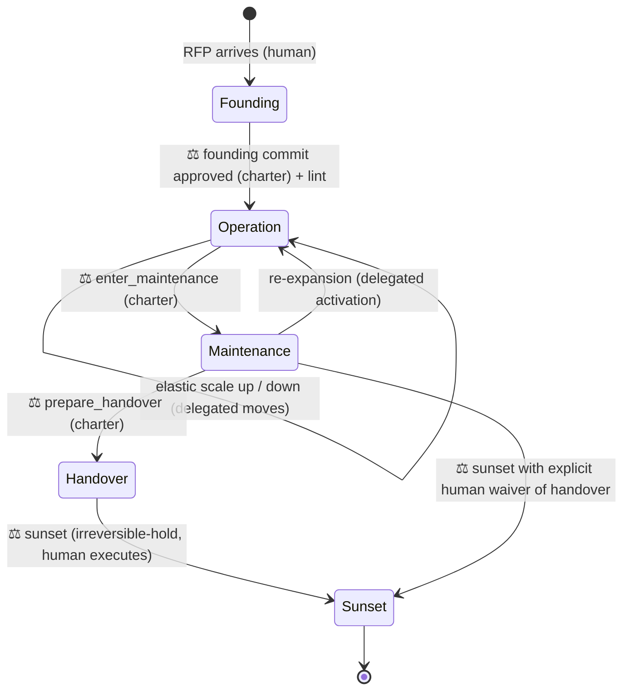

# 06 — Lifecycle & Operations: Cradle to Grave, 24 Hours a Day

> This document operationalizes the repo's decision line (THEORY Organ 6): how an
> agent organization is **founded from an RFP**, how it **runs around the clock with the
> human deciding only the essential things**, how it **scales and shrinks elastically**
> (docs/05), and how it **ends** — maintenance, handover, sunset. The design goal restates
> the whole thesis operationally: a human CEO decides the few essential things and delegates
> the thousand small ones, drawing that line *by feel*; here the line is **written down** so
> the AI can run the small decisions unattended while the human's 8 hours go to the
> essential ones. Everything below — the three tiers, the approval queue, the morning digest
> — is that articulated decision line in operation. Calibrate it to risk (docs/01 §5):
> the ceremony is for the stakes that warrant it, not for every trivial call —
> over-governing recreates the bottleneck delegation was meant to remove.

The lifecycle state machine (edges marked ⚖ require human adjudication — they are
charter- or irreversible-tier):

Every transition is a commit; every commit passes the audit lint (tools/org_lint.py).
The lint validates the resulting *state* (SoD, span, control-never-dormant, schema);
tier enforcement — that the right authority approved the transition — is the runtime's
job, recorded in the ledger.

---

## 1. Founding: from RFP to organization

The cradle. A human hands the system an RFP (or any statement of what must be built),
together with a **constitution instance authored by the humans beforehand** (the founder
works inside it and cannot write it). A **founder process** — see `template/FOUNDER.md`
— turns the RFP into a complete latent organization in four steps:

1. **Distill the telos (Organ 1).** The RFP is restated as a one-sentence purpose that
   every department will carry in its context pack (as the intent block, docs/08 §2.1).
   The RFP itself is preserved in the ledger as the purpose's source document; the
   *admission standard* is derived from its acceptance criteria — and every criterion
   must reference at least one gaming-defense instrument (nulls, placebos, forward
   tests), or the founding is returned to the humans.
2. **Derive the target architecture, then the org (inverse Conway).** Decide the shape
   of the *system* the RFP describes first; then shape the departments and their
   communication paths to mirror it (docs/04 §3). The org chart is a consequence of the
   product architecture, never the other way around.
3. **Decompose the RFP into output contracts.** Each department gets a *mission* stated
   as a deliverable slice of the RFP — **what** it owes and to what standard, never
   **how** (standardization of outputs, Mintzberg). This is what lets departments work
   **independently toward the shared RFP**: coordination happens through the contract
   seams (docs/08 §2.3), the shared ledger, and context packs — not through a central
   agent dictating steps. Each contract names its Checker; no contract is admitted by
   its own Maker.
4. **Design fully, activate minimally (docs/05).** The chart includes every department
   the RFP will *ever* need — including the maintenance watch and the handover packager
   — all latent. Then activate the smallest set the first milestone requires, plus the
   control skeleton (gate, skeptic, supervisor, registrar), which is active whenever
   anything is.

**The founding commit is charter-tier: it requires human approval, not just the lint.**
The founding commit defines the SoD matrix, the contracts, and the admission standard —
the most control-critical act in the org's life — and a mechanical shape-check cannot
judge whether an acceptance criterion is a gameable proxy. The humans sign the chart the
org will be held to; Stinchcombe's imprinting result says founding conditions persist,
so this is the cheapest moment to get control right. Founding ends when the commit has
both lint pass and human approval, and the first activation set is running. Everything
after this line is autonomous, within the constitution.

### Independent execution, shared consciousness

After founding, no agent tells a department *how* to meet its contract. Autonomy is made
safe the McChrystal way (docs/04 §6), refined by the context economy (docs/08): every
department cycle begins with a context pack holding the intent block, its own contract
and doctrine (docs/07), the live state of its adjacent contracts, and nearby failures —
and nothing else by default. Departments coordinate through contract interfaces and the
ledger — mutual adjustment at the seams, never central micromanagement in the middle.

---

## 2. Around-the-clock operation: humans above the loop, not in it

An agent org's structural advantage is a 24-hour duty cycle against the humans' 8. The
design error to avoid is making human approval a **synchronous blocker** — that re-caps
the org at human hours. The fix is a **delegation-of-authority (決裁権限) matrix plus an
asynchronous approval queue** — inspired by the written-proposal aspect of 稟議 (ringi):
agents propose in writing, the authority above decides. (Deliberately *unlike* real
ringi, there is no consensus round: one accountable human adjudicates. Real ringi is a
consensus-formation practice and is famously slow; only its paper trail is borrowed.)
The night shift acts within delegated bounds, queues what exceeds them, and keeps
working.

### 2.1 Three authorization tiers

The tiers' **behaviors** are fixed here; the authoritative **item lists** live in
`template/constitution.yaml` (single source of truth — the table below deliberately
names no items, so it cannot drift):

| Tier | Overnight behavior |
|---|---|
| **Delegated** | Execute immediately; record in ledger |
| **Charter (approval queue)** | **Queue, don't block**: file a proposal (diagnosis + diff + expected effect), continue with other legal moves |
| **Irreversible hold** | **Prepare fully, execute never**: advance every reversible step so the morning human approves a finished package, not a plan |

The third tier is where the 24-hour advantage compounds: overnight the org advances
everything to *one step before the point of no return* — with two guards, because a
fully staged irreversible is a loaded gun: **staging stops before assets materialize
outside the boundary** (no secrets, exports, or funds assembled at the edge), and
**concurrent held actions are capped per class** so the night cannot stage fifty
irreversibles to swamp the morning review.

### 2.2 The approval queue is rate-limited by design

The queue is an attack surface: flooding it exhausts the adjudicating human, and a
bundled diff hides a bad change inside a good one. Three structural rules
(constitution-enforced):

- **One concern per proposal.** A charter diff touches exactly one charter subject;
  multi-subject diffs are auto-rejected and split.
- **One open proposal per subject; identical diffs dedup.** A stuck loop cannot become
  a proposal generator (the no-progress rule files once, then waits).
- **Charter items are never batch-adjudicated and have no time budget.** The
  15-minute morning budget applies to the digest, not to charter decisions — a
  delegation-bound or SoD change gets read for as long as it takes, every time.

### 2.3 The morning digest

Autonomy raised at night must be matched by information delivered in the morning.
The digest is generated by the **registrar** (§2.6) as a **deterministic projection of
the ledger** — any human can re-run the projection and must get the same document. It
always contains a **mandatory census**: counts of every ledger event class for the
window (so activity cannot be hidden by curation), then exceptions in detail: reorg
commits, open proposals, held irreversibles, anomalies, budget report. Target: a human
audits a night in fifteen minutes. If the digest can't be read in fifteen minutes, fix
the digest, not the human — but never by omitting census rows.

### 2.4 Night safe mode (fail-safe, not fail-open)

Escalation needs a receiver; at night there is none. The rule is **fail-safe by
default**: admission proceeds overnight only for events that match a **pre-registered
sensor pattern exactly**; any signal that does not match — anomalous budget burn, a
crisis shape outside the catalog, the gate rejecting everything — suspends admission
org-wide while exploration continues. Making is cheap and reversible; trusting is not.
The org does not get to classify a surprise as "defined" to keep admitting (that
classification is itself mechanistic and logged). Ledger corruption or a tripped safety
limit is the exception: immediate global halt.

Two human channels, strictly separated: the **digest** (read in the morning) and the
**wake-up push** (global halt, safety limit, ledger anomaly — nothing else). The
ledger-anomaly and safety-limit detectors sit **outside the org's write authority** (an
external watchdog over the append-only store), with a dead-man's switch: a missing
"invariants hold" heartbeat is itself a page. An org that pages its humans for queue
items will teach them to ignore the pager; an org that self-reports its own corruption
will eventually not.

### 2.5 What the humans' 8 hours become

Three jobs only: **adjudicate the queue and the held irreversibles** (morning),
**revise the purpose/intent** when the world changes (Organ 1 stays human-held;
propagation per docs/08 §2.1), and **tune the delegation bounds** — widening them as
the ledger demonstrates trustworthy nights, narrowing after incidents. That third job
is how the org grows up: trust is extended on audited evidence, exactly as a new hire
earns signing authority.

### 2.6 The registrar: who actually runs the metabolism

Someone must evaluate sensors, select legal moves, author reorg diffs, assemble context
packs, generate the digest, and service the approval queue. That actor is the
**registrar** — a mechanistic control role declared in `organization.yaml`, deliberately
shaped as a *clerk, not a ruler*:

- It is the **Maker of reorg diffs**, never their approver: every diff it authors must
  pass the lint (machine) and the gate (authorization) — the registrar holds no
  admission authority of its own.
- It executes only moves from the catalog whose preconditions its ledger-recorded
  sensor readings satisfy; judgment-preconditions marked `judge: human` in moves.yaml
  are queued, not decided.
- Its own profile is mechanistic → charter-tier to change; its outputs (digest, packs)
  are deterministic projections, reproducible by anyone.

This closes the "passive voice" gap: nothing in the metabolism happens without a named,
bounded, checkable actor.

---

## 3. Elastic operation

Covered in full in docs/05; the operational summary: sensors (the crisis signals of
docs/02 §4, made measurable) trigger moves from `template/moves.yaml`; every move has
preconditions, an authorization tier, and a reversal; scale-down is a first-class move
(lossless — profile and ledger history persist); the control skeleton scales with
active exploration and never sleeps while anything explores. Doctrine keeps latent
departments current on re-activation (docs/07); scopes keep active ones lean (docs/08).

---

## 4. Maintenance, handover, sunset (the grave)

Greiner has no final stage; a cradle-to-grave org needs one. (Organization theory does
have accounts of endings — decline (Whetten), organizational mortality (Hannan &
Freeman's ecology) — but no *playbook* for a designed, orderly wind-down; this section
is that playbook.) Conway's law runs both ways: when the product stops changing, the
org that mirrors it should contract.

### 4.1 Maintenance

Entry: the RFP's deliverables are admitted and residual work is corrective —
`enter_maintenance` is charter-tier (a human confirms the reading). The org inverts:
the exploration front goes mostly latent; the pre-designed watch set (monitor + fixer +
their checker) activates. Structure is preserved, not dismantled: latency is free, and
re-expansion (a new major RFP amendment) is just re-activation with full institutional
memory and refreshed doctrine.

### 4.2 Handover

The org prepares its own succession package from the ledger: the purpose and its intent
history, every contract and its admission record, all profiles and doctrines as edited
(the supervisor's coaching history is the org's accumulated management knowledge), the
scope matrix, and the open-risk register. The *no knowledge outside the ledger*
invariant (docs/05 §5) is what makes this package **near-complete by construction** —
"near", because the invariant is enforced by discipline and audit, not yet by proof.
The successor may be a human team or another agent org.

### 4.3 Sunset

All members deactivate; the ledger is archived read-only; the constitution instance is
retired. **Sunset is an irreversible-hold action: the org may prepare it, only humans
execute it** — an organization does not adjudicate its own death, both for safety and
because the humans, not the org, own the judgment that its purpose is spent. The
reverse door stays open: an archived org plus its ledger is a template plus experience,
and can be re-founded.

### 4.4 Re-founding — the CEO tears down and rebuilds, assets intact

Between reorganizing at the edges (moves.yaml) and dying (sunset) sits the move only the
human at the top may make: **on noticing a *root* problem in how the org is shaped, tear down
the role structure wholesale and re-found it with new roles — while keeping every accumulated
asset.** This is the top of the authority hierarchy. Section-chiefs scale within a section,
dept-heads within a department (§scale-authority / docs/05); the CEO may reshape the *whole
chart*, and only the CEO may, because it re-mints the SoD skeleton and the decision line that
found the org (a founding-tier act, Stinchcombe imprinting again).

What "assets intact" means precisely — the structure is what changes; **the assets are
custody-of-the-ledger, not property of any role**, so they survive a total re-map:

- **The ledger** (`custody: ledger`, not an agent) is the single source of truth. Tearing down
  every role does not touch it; the append-only history, admitted results, and event chain
  persist by construction (docs/05 §5, the *no-knowledge-outside-the-ledger* invariant).
- **Doctrine** (each role's accumulated べき論) is **role-keyed** (`<root>/<role>.json`), so a
  re-found that renames or re-splits roles must **re-map doctrine to the new roles, not orphan
  it.** The refound diff therefore carries an explicit `doctrine_remap: {old_role: new_role}`;
  claims whose `affected_roles` no longer name a live role are re-homed by the map, and any
  claim left unmapped is surfaced to the human (never silently dropped) before the re-found
  commits. This is the one asset that structure-change can lose, so it is the one the move
  guards explicitly.
- **Admitted results, contracts, the intent history, the supervisor's coaching record** are all
  ledger-derived views — they re-project onto whatever new roles are granted them; nothing is
  lost, it is re-scoped.

**Re-founding is charter-tier and human-executed** — it is a founding act, so it inherits
founding's rule: humans author the new structure inside the *unchanged* constitution (the
constitution outlives the re-found; if the charter itself is wrong, that is a separate,
higher act), the new founding commit passes the lint, and the re-found is one atomic ledgered
event so a crash mid-re-found leaves the old structure intact (the ledger's append-only chain
is never half-written). *It survives being torn down because the thing that holds the value —
the ledger — was never part of the structure being torn down.*

---

## 5. Interlocks (why this doesn't violate the repo's own rules)

- **The approval queue ≠ self-modification of control.** Charter-tier changes are
  *proposed* by agents but *decided* by humans — the supervisor's profile-editing power
  (template/SUPERVISOR.md) applies to **organic roles only**; edits to mechanistic
  (control) role profiles, and to any profile's immutable discipline preamble
  (template/ROLE.md), are charter-tier. This closes the self-modification loophole the
  two-layer law (docs/03 §3) warns about: edit *authority* obeys the same split as
  runtime behavior.
- **Night safe mode preserves Maker/Checker.** Suspending admission keeps the gate's
  authority intact when its human backstop is absent; it never transfers that authority
  to the makers.
- **The founder is not exempt — it is the most constrained actor of all.** Its commit
  needs the lint *and* a human charter approval, it cannot write the constitution, and
  it holds no standing role afterward.
- **The registrar is a clerk.** It makes diffs and projections; it approves nothing.

---

## Sources

- McChrystal, S. et al. 2015 — *Team of Teams* (shared consciousness / empowered
  execution; see docs/08 for the refinement used here).
- 稟議 (ringi) — Japanese written-proposal approval practice; only the written-proposal
  aspect is borrowed (see docs/sources.md for the honest scoping of this analogy).
- Delegation-of-authority (決裁権限) matrices — standard corporate governance practice.
- Stinchcombe, A. 1965 — "Social Structure and Organizations" (imprinting; liability of
  newness).
- Whetten, D. 1980 (organizational decline); Hannan & Freeman (organizational ecology).

*Status: the tier behaviors, queue rules, and safe-mode defaults are design commitments,
not validated results. The sensor formulas live in template/sensors.yaml, the ledger and
pack machinery in template/ledger-schema.yaml, and the enforcing runtime is specified with
a conformance checklist in docs/09-runtime.md — specified, not yet shipped as code (see
README's status section for the honest boundary).*
