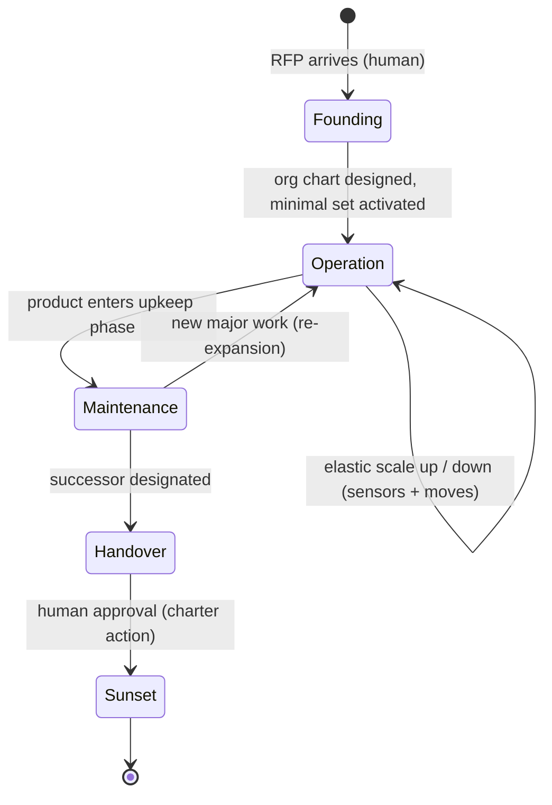

# 06 — Lifecycle & Operations: Cradle to Grave, 24 Hours a Day

> This document operationalizes the repo: how an agent organization is **founded from an
> RFP**, how it **runs around the clock without a human in the loop**, how it **scales
> and shrinks elastically** (docs/05), and how it **ends** — maintenance, handover,
> sunset. The design goal: the humans work their 8 hours on *judgment*; the organization
> works 24 on *everything else*.

The lifecycle state machine:

Every transition is a commit; every commit passes the audit lint (tools/org_lint.py).

---

## 1. Founding: from RFP to organization

The cradle. A human hands the system an RFP (or any statement of what must be built).
A **founder process** — see `template/FOUNDER.md` — turns it into a complete latent
organization in four steps:

1. **Distill the telos (Organ 1).** The RFP is restated as a one-sentence purpose that
   every department will carry in its context pack. The RFP itself is preserved in the
   ledger as the purpose's source document; the *admission standard* is derived from its
   acceptance criteria. The metric stays subordinate to the purpose, per THEORY.md.
2. **Derive the target architecture, then the org (inverse Conway).** Decide the shape
   of the *system* the RFP describes first; then shape the departments and their
   communication paths to mirror it (docs/04 §3). The org chart is a consequence of the
   product architecture, never the other way around.
3. **Decompose the RFP into output contracts.** Each department gets a *mission* stated
   as a deliverable slice of the RFP — **what** it owes and to what standard, never
   **how** (standardization of outputs, Mintzberg). This is what lets departments work
   **independently toward the shared RFP**: coordination happens through the contract,
   the shared ledger, and context packs — not through a central agent dictating steps.
   Each contract names its Checker; no contract is admitted by its own Maker.
4. **Design fully, activate minimally (docs/05).** The org chart includes every
   department the RFP will *ever* need — all latent. Then activate the smallest set the
   first milestone requires, plus the control skeleton (gate, skeptic, supervisor,
   ledger), which is active whenever anything is.

Founding ends when: `organization.yaml` (instance) + `constitution.yaml` (instance) are
committed, the lint passes, and the first activation set is running. Everything after
this line is autonomous, within the constitution.

### Independent execution, shared consciousness

After founding, no agent tells a department *how* to meet its contract. Autonomy is made
safe the McChrystal way (docs/04 §6): every increase in independence is matched by an
increase in shared context. Concretely, each department cycle begins with a context pack
containing: the purpose (RFP distillate), its own contract, the **live state of adjacent
contracts** (what its inputs/outputs depend on, from the ledger), and nearby failures.
Departments coordinate through the ledger and through contract interfaces — mutual
adjustment at the seams, never central micromanagement in the middle.

---

## 2. Around-the-clock operation: humans above the loop, not in it

An agent org's structural advantage is a 24-hour duty cycle against the humans' 8. The
design error to avoid is making human approval a **synchronous blocker** — that re-caps
the org at human hours. The fix is the classic one from companies that never sleep:
**delegation-of-authority rules plus an asynchronous approval queue (稟議/ringi)**. The
night shift doesn't wake the director; it acts within delegated bounds, queues what
exceeds them, and keeps working.

### 2.1 Three authorization tiers (defined in `template/constitution.yaml`)

| Tier | Contents | While humans are away |
|---|---|---|
| **Delegated** | Everything inside the exploration front: task work, organic self-organization, span-respecting activation moves | Execute immediately; record in ledger |
| **Charter (ringi)** | Constitution-level changes: SoD matrix, control-role profiles, admission standards, delegation bounds themselves | **Queue, don't block**: file a ringi item with the diagnosis and proposed diff, then continue with other legal moves |
| **Irreversible hold** | Actions that cannot be undone or leave the boundary: production deploys, external publication, asset movement, sunset | **Prepare fully, execute never**: run every reversible step (build, verify, stage, generate the diff) so the morning human approves a finished package, not a plan |

The third tier is where the 24-hour advantage compounds: overnight the org advances
everything to *one step before the point of no return*. The human's morning is spent
approving, not waiting for work to happen after approval.

### 2.2 The morning digest

Autonomy raised at night must be matched by information delivered in the morning
(McChrystal, applied across the human/agent boundary). Generated from the ledger, by
exception: one line if all is on course; full detail only for reorg commits, ringi
items, held irreversibles, and anomalies. Target: a human audits a night of operation in
fifteen minutes. If the digest cannot be read in fifteen minutes, that is a span-of-
control failure on the human — fix the digest, not the human.

### 2.3 Night safe mode

Escalation needs a receiver; at night there is none. When an undefined signal fires —
budget burning anomalously, a crisis pattern outside the sensor catalog, the gate
rejecting everything — the org **degrades instead of halting**: exploration may
continue, but **admission is suspended** (nothing is promoted to trusted state until a
human reviews). Making is cheap and reversible; trusting is not. Ledger corruption or a
tripped safety limit is the exception: immediate global halt.

Two human channels, strictly separated: the **digest** (read in the morning) and the
**wake-up push** (global halt, safety limit, ledger anomaly — nothing else). An org that
pages its humans for ringi items will teach them to ignore the pager.

### 2.4 Budget as circadian rhythm

A 24-hour org burns tokens unattended, so Organ 4's `budget_guard` gets a schedule:
per-window budgets (a night-exploration cap), and a **no-progress rule** — the same
crisis signal answered by the same move N times without improvement suspends that line
of work and files a ringi. "Running all night" and "progressing all night" are different
things; without this, night operation is sixteen hours of repeating a mistake faster
(THEORY.md, Organ 4 failure mode).

### 2.5 What the humans' 8 hours become

Three jobs only: **adjudicate the ringi queue and held irreversibles** (morning),
**revise the purpose** when the world changes (Organ 1 stays human-held), and **tune the
delegation bounds** — widening them as the ledger demonstrates trustworthy nights,
narrowing them after incidents. That third job is how the org grows up: trust is
extended on audited evidence, exactly as a new hire earns signing authority.

---

## 3. Elastic operation

Covered in full in docs/05; the operational summary:

- Sensors (the crisis signals of docs/02 §4, made measurable) trigger moves from
  `template/moves.yaml`; every move has preconditions, an authorization tier, and a
  reversal.
- Scale-down is a first-class move. A department with an empty queue for a full review
  cycle is deactivated — losslessly, since its profile and ledger history persist.
- The control skeleton scales with active exploration and never sleeps while anything
  explores.

---

## 4. Maintenance, handover, sunset (the grave)

Greiner has no final stage; a cradle-to-grave org needs one. Conway's law runs both
ways: when the product stops changing, the org that mirrors it should contract.

### 4.1 Maintenance

Entry: the RFP's deliverables are admitted and residual work is corrective. The org
inverts — the exploration front goes mostly latent; a small watch (monitor + fixer +
their checker) stays active. Structure is preserved, not dismantled: latency is free,
and re-expansion (a new major RFP amendment) is just re-activation with full
institutional memory.

### 4.2 Handover

The org prepares its own succession package from the ledger: the purpose and its
history, every contract and its admission record, all profiles as edited (the
supervisor's coaching history is the org's accumulated management knowledge), and the
open-risk register. Because of the *no knowledge outside the ledger* invariant
(docs/05 §5), this package is complete by construction — the org has no tacit knowledge
to lose. The successor may be a human team or another agent org.

### 4.3 Sunset

All members deactivate; the ledger is archived read-only; the constitution instance is
retired. **Sunset is a charter action requiring human approval** — an organization does
not adjudicate its own death, both for safety and because the humans, not the org, own
the judgment that its purpose is spent. The reverse door stays open: an archived org plus
its ledger is a template plus experience, and can be re-founded.

---

## 5. Interlocks (why this doesn't violate the repo's own rules)

- **Ringi ≠ self-modification of control.** Charter-tier changes are *proposed* by
  agents but *decided* by humans — the supervisor's profile-editing power (see
  `template/SUPERVISOR.md`) applies to organic roles only; edits to mechanistic
  (control) role profiles are charter-tier. This closes the loop identified in the SoD
  analysis: the two-layer law applies to *edit authority*, not just runtime behavior.
- **Night safe mode preserves Maker/Checker.** Suspending admission keeps the gate's
  authority intact when its human backstop is absent; it never transfers that authority
  to the makers.
- **The founder is not exempt.** The founding commit passes the same lint as every later
  reorg commit; an org can no more be *born* violating SoD than evolve into it.
